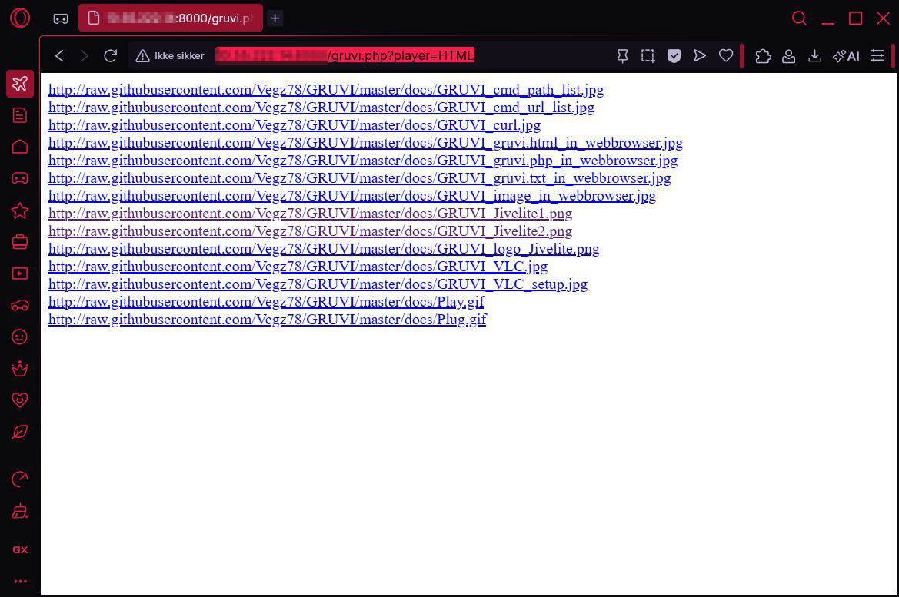
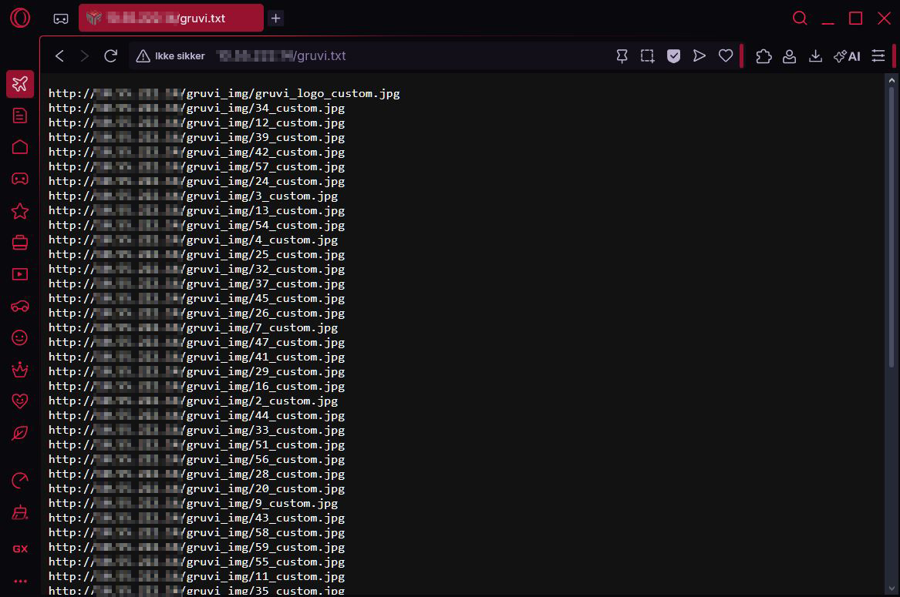
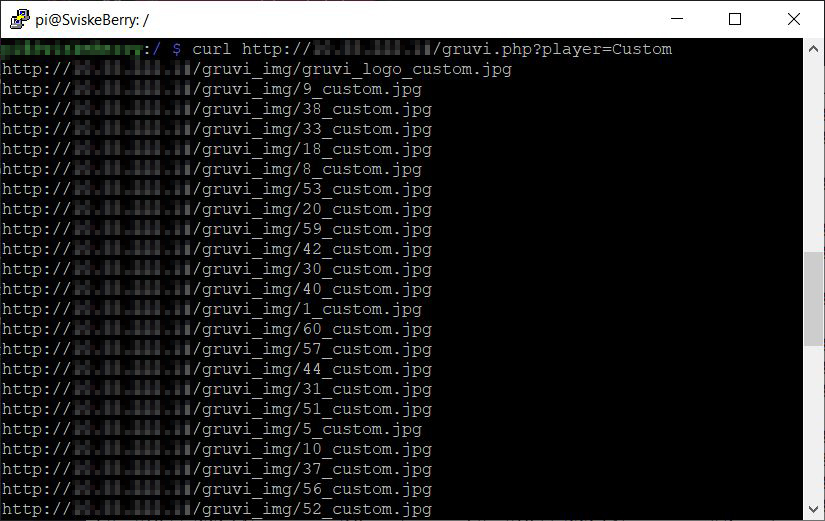
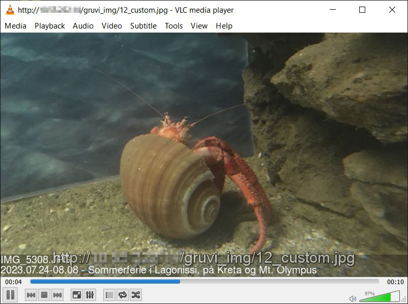
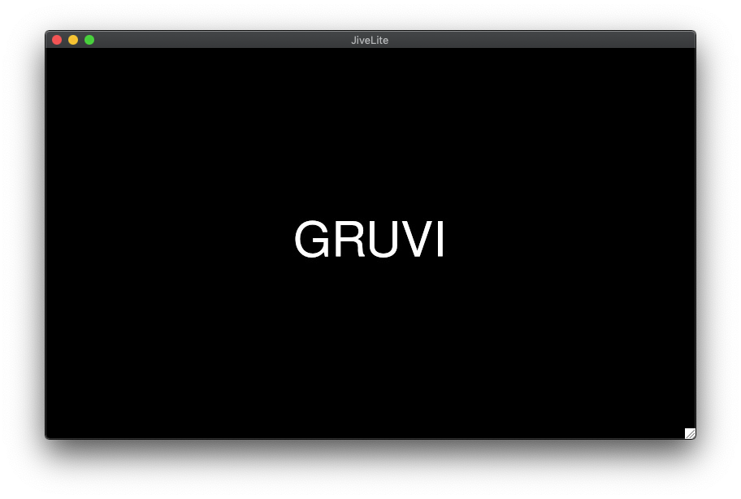
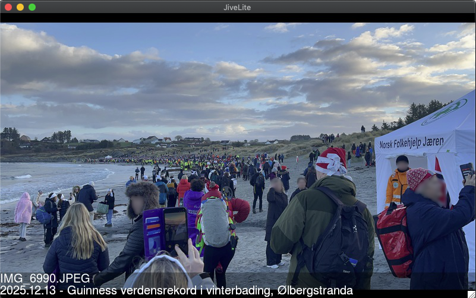
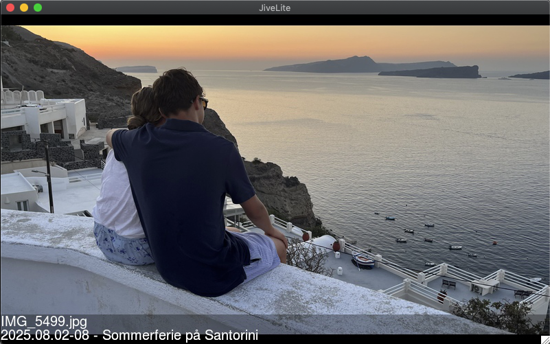
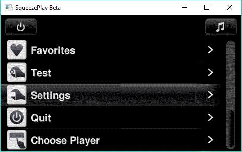

# GRUVI 
### [(.generate.random.URLs_for.viewing.images.)](https://vegz78.github.io/GRUVI)
Image file URL or path list generator & batch converter for displaying a list of image files on a web server or in a text file, or for screensaver/slideshow of custom images via the Image Viewer app (photo frame) on the Squeezebox/Logitech/Lyrion Touch, Radio, Jivelite, Squeezeplay etc.<br><br>

| | | | |
|:-------------------------:|:-------------------------:|:-------------------------:|:-------------------------:|
|[](https://github.com/Vegz78/GRUVI/blob/master/docs/GRUVI_cmd_url_list.jpg?raw=true)|[](https://github.com/Vegz78/GRUVI/blob/master/docs/GRUVI_cmd_path_list.jpg?raw=true)|[](https://github.com/Vegz78/GRUVI/blob/master/docs/GRUVI_gruvi.html_in_webbrowser.jpg?raw=true)|[](https://github.com/Vegz78/GRUVI/blob/master/docs/GRUVI_gruvi.php_in_webbrowser.jpg?raw=true)|
|Cmdline paths list|Cmdline URLs list|GRUVI html in web browser|gruvi.php in web browser|

GRUVI functions as a command line tool to fairly quickly produce lists of file paths or URL-links to images from a selection of folders and their subfolders. Or to convert the images in similar folder selections to custom copies in the default gruvi_img folder in the working directory of the script, with corresponding lists of file paths or URL-links to these copies.<br><br>

| | | | |
|:-------------------------:|:-------------------------:|:-------------------------:|:-------------------------:|
|[](https://github.com/Vegz78/GRUVI/blob/master/docs/GRUVI_gruvi.txt_in_webbrowser.jpg?raw=true)|[](https://github.com/Vegz78/GRUVI/blob/master/docs/GRUVI_curl.jpg?raw=true)|[](https://github.com/Vegz78/GRUVI/blob/master/docs/GRUVI_VLC_setup.jpg?raw=true)|[](https://github.com/Vegz78/GRUVI/blob/master/docs/GRUVI_image_in_webbrowser.jpg?raw=true)|
|gruvi.txt in web browser|GRUVI with Curl|GRUVI in VLC|GRUVI image in web browser|
| | | | |

gruvi.php should work on any webserver with PHP support and when called directly from either any web browser or any LMS player with a screen to display images. gruvi.php identifies the SB Radio or Touch players automatically based on the HTTP_USER_AGENT provided by the Image Viewer application and adjusts the corresponding image dimensions accordingly to show correctly on their screens. Additional adjustments to settings in the gruvi.php script files itself or from the command line can be made to accomodate other players and screen sizes, like the O2 Joggler and any skin or screen size for Squeezeplay, Jivelite etc.<br><br>

| | | | |
|:-------------------------:|:-------------------------:|:-------------------------:|:-------------------------:|
|[](https://github.com/Vegz78/GRUVI/blob/master/docs/GRUVI_logo_Jivelite?raw=true)|[](https://github.com/Vegz78/GRUVI/blob/master/docs/GRUVI_Jivelite1.png?raw=true)|[](https://github.com/Vegz78/GRUVI/blob/master/docs/GRUVI_Jivelite2.png?raw=true)|[](https://github.com/Vegz78/GRUVI/blob/master/docs/Play.gif?raw=true)|
|GRUVI logo in Jivelite|GRUVI image in Jivelite|GRUVI image in Jivelite|Image Viewer setup|
| | | | |

> [!NOTE]
> ## Features, Prerequisites, Installation & Usage on LMS:
> See my original post: https://forums.slimdevices.com/showthread.php?108498-Announce-GRUVI-generate-random-URLs_for-viewing-image


## Features
* Flexibile command line tool or web sever hosted script with many options in the settings in the gruvi.php script itself or through command line or URL arguments
* Random or ordered selection of files and with choice of random shuffling of the lists with links to image files between every call to gruvi.php on independent web servers, or with periodic scheduled jobs
* Make locally cached copies of the images with reduced sizes or link directly to the original image files
* Make links to the image files as URL addresses or as file paths. The URL addresses can be made active/clickable
* Image files hosted on a web server of your choosing and copies fittet to custom (screen) sizes
* Choice between images with or without capitons generated by file and folder names
* Choice of number of cached image copies and expiry time for reload of new batches of images
* Support for multiple image folders with internal distribution weighing for the image selection
* Choice between serial and parallel processing of the ImageMagick conversions of image folders
* Make lists of preset sizes or choose instead to scan all images in your selected folders and make links to all images found
* Informative console output of job settings and practical DRYRUN argument to test your chosen settings before execution
* Extensive command line help screen called with the arguments -h, --help, /? or HELP
* Support for bmp, cr2, gif, heic, jpeg, png, tiff and webp image source files
* Runs on Windows, Linux and MacOS

If used together with the Lyrion Music Server: Choice between total independence from LMS on any web server, or to run on the LMS internal web server.

## Usage
```plaintext
php gruvi.php ARG1, ARG2, ... , ARGN       -Often needs sudo in front for permissions

Example:
php gruvi.php . RAND CONV 50               -Find and convert 50 random images from the
                                            current folder including subfolders
```
COMMAND LINE ARGUMENTS:
```plaintext
(Default argument values can be omitted)
FOLDER1, FOLDER2, ... , FOLDERN            -Folders where GRUVI should look for images to
                                            convert (EMPTY = use settings inside gruvi.php)
NUMBER, e.g. 50                            -NUMBER = The no. of image files to pick, e.g. 50
FULL                                       -FULL = Make list as big as the number of files
                                            actually found, instead of a preset selection
                                            size from the NUMBER argument or the 60
                                            setting inside gruvi.php
FILE|URL (default)                         -FILE = Make list as folder paths
                                            URL = Make list of images as web urls with
                                            server address inside gruvi.php as root
RAND|SORT (default)                        -RAND = Shuffle the list,
                                            SORT = Present list as found in the scanned
                                            directory tree
CONV|LINK (default)                        -CONV = Make converted copies of images to the
                                            folder specified in gruvi.php(default: gruvi_img)
                                            linked to in the file sbradio.txt,
                                            LINK = Only link to the found files, no
                                            conversions and links found in the file
                                            gruvi.txt
GRUVI|NOLOGO (default)                     -GRUVI = Add extra image file with the GRUVI logo
                                            NOLOGO = Do not at GRUVI logo image file
CAPT|NOCAP (default)                       -CAPT = Add image caption of file and folder names
                                            NOCAP = Do not add captions
CUST|STND (default)                        -CUST = Make image copies of custom dimensions
                                            STND = Standard dimension 320x240
HTML|TEXT (default)                        -HTML = HTML lists w/ working links to image files
                                            TEXT = Regular text file lists
CUSTOM DIMENSION e.g. 1280x720             -Custom image copy dimension as width x height
DRYRUN                                     -DRYRUN = Stop before execution, showing settings
HELP (or /? or -h or --help)               -HELP = Show this help screen

SPECIAL CASES AND FOR LMS:
php gruvi.php                              -Produces images for the Squeezebox Radio with
                                            settings set inside the gruvi.php script file
php gruvi.php Touch                        -Produces images for the Squeezebox Touch with
                                            settings set inside the gruvi.php script file
php gruvi.php CUST                         -Produces images for a custom player screen or
                                            web browsers with settings set inside the
                                            gruvi.php script file
```
IN WEB BROWSERS / THE SB PLAYER'S IMAGE VIEWER SOURCE SPECIFIC SETTINGS:
```plaintext
(replace with webserver's true IP address and root folder):
http://192.168.x.y/gruvi.php               -Produces image list directly with images for the
                                            SB Radio with settings set inside the gruvi.php
                                            script file
http://192.168.x.y/gruvi.php?player=Touch  -Produces image list directly with images for the
                                            SB Touch with settings set inside the gruvi.php
http://192.168.x.y/gruvi.php?player=Custom -Produces image list directly with images for a
                                            custom player, e.g. the O2 Joggler 800x480, with
                                            custom settings inside the gruvi.php script file

For the Lyrion/Logitech/Squeezebox Music Server's built in webserver
(replace with the LMS' true IP address):
http://192.168.x.y:9000/html/sbradio.txt   -Image list directly to images for the SB Radio
                                            with settings set inside the gruvi.php script
http://192.168.x.y:9000/html/sbtouch.txt   -Image list directly for the Touch or a custom
http://192.168.x.y:9000/html/gruvi.txt      player with settings inside the gruvi.php script

Since the LMS internal webserver does not support PHP, the images pointed to in the lists
must be produced by a scheduled task on the computer running LMS.
```
Feel free to copy, modify and use as you want. The script does what it's supposed to on my home system and won't be very actively supported, updated or maintained.

## Prerequisites
* PHP version 5 or newer (preferably in the OS' [$PATH environment variable](https://configu.com/blog/setting-env-variables-in-windows-linux-macos-beginners-guide/#:~:text=PATH%3A%20Defines%20directories%20where%20executable%20files%20are%20located%2C))
* ImageMagick version 6 or 7 (must be in the OS' [$PATH environment variable](https://configu.com/blog/setting-env-variables-in-windows-linux-macos-beginners-guide/#:~:text=PATH%3A%20Defines%20directories%20where%20executable%20files%20are%20located%2C))
* Some webserver with access to the photos you want to show<br>
(Now GRUVI supports running on the LMS's internal web server)

>[!TIP]
>Easily run an ad hoc web server using PHP's built-in:
>`php -S 192.168.x.y:8000 -t .`, where the IP address must be changed to your machine's local IP address, and . is the current working directory of `gruvi.php`

>[!CAUTION]
>[Never run PHP's built-in web server on a public network!](https://www.php.net/manual/en/features.commandline.webserver.php#:~:text=web%20server%20%C2%B6-,Warning,-This%20web%20server)

## Installation

### Installation as an independent command line tool
1. [Download the latest release](https://github.com/Vegz78/GRUVI/releases) or `git clone https://github.com/Vegz78/GRUVI`
2. If applicable, make gruvi.php executable: `(sudo) chmod 755 gruvi.php`
3. Store gruvi.php or a link to gruvi.php inside one of your $PATH folders

### Installation on a web server
1. [Download the latest release](https://github.com/Vegz78/GRUVI/releases) or `git clone https://github.com/Vegz78/GRUVI` into the folder you want gruvi.php hosted from on the web server
2. Set the global variables to suit your needs in the main gruvi.php script file ([See the settings here](https://github.com/Vegz78/GRUVI/blob/e868137d82cc94311c95683ac2bd404641717f65/gruvi.php#L40))<br>
  (Make sure that the global [$URL_ROOT setting](https://github.com/Vegz78/GRUVI/blob/e868137d82cc94311c95683ac2bd404641717f65/gruvi.php#L50) matches the web server's external/public URL)
3. Set the required execution and read/write file permissions (usually the web server user/group and `chmod 755`) on:
   * gruvi.php
   * gruvi.txt, sbradio.txt and sbtouch.txt
   * the ./gruvi_img folder
4. Ensure that the gruvi.php script and web server user/group has read permissions for the image source paths

## Updates history
2026.01.26: Added more consistent sorting of paths and URLs and option to make the URL links live/clickable (<a ref="">)
2026.01.23: Extended functionality as a command line tool, added URL arguments, added option to search all image files in selected folders, cleaned up image thumbs file handling and support for newer versions of ImageMagick, tested on Windows, Linux and MacOS and some other small bugfixes and improvements<br>
2026.01.12: Added support for bmp, cr2, gif, heic, png, tiff and webp in addition to jpeg, new ability to run on Windows in addition to Linux and MacOS, and various bug fixes and clean-ups<br>
2021.10.30: Bugfixed a race condition and added option for GRUVI logo and output buffer flush for faster display of image URL list from gruvi.php<br>
2021.10.28: Added support for running directly in LMS' internal web server and choice between serial and parallel conversion of image files.<br>
2020.09.10: Added the possibility to choose multiple image folders with internal weighting of selections from each folder.<br>
